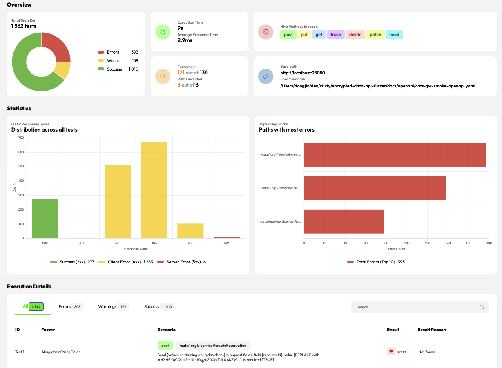
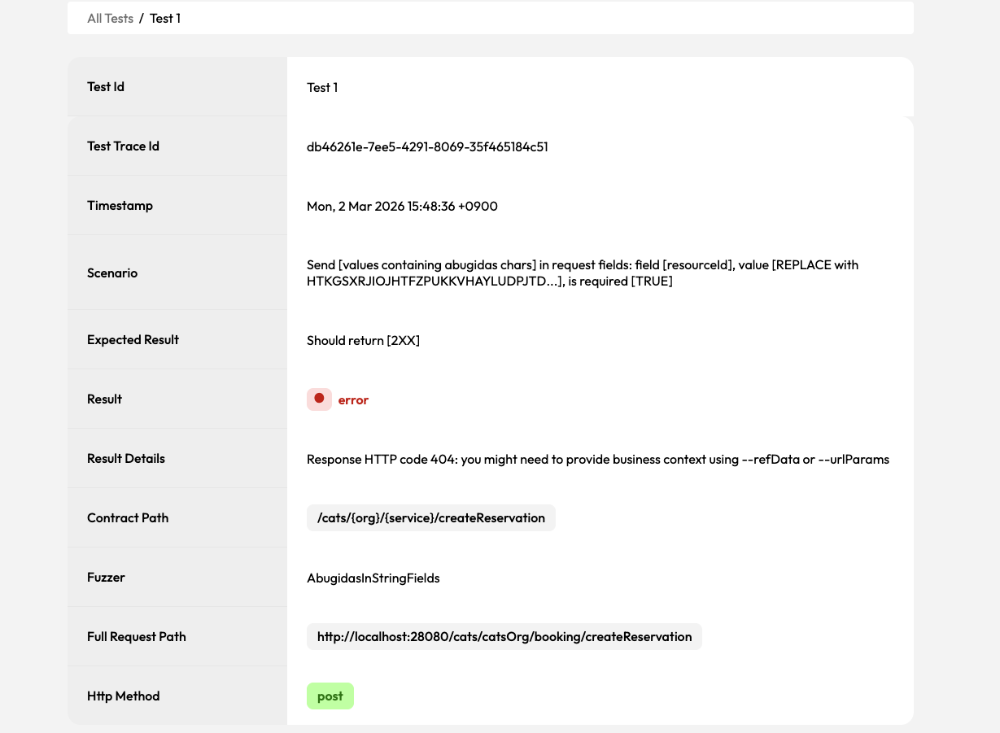
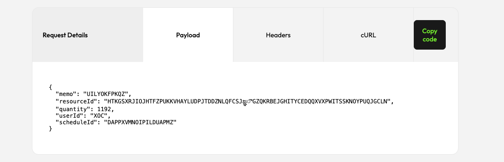
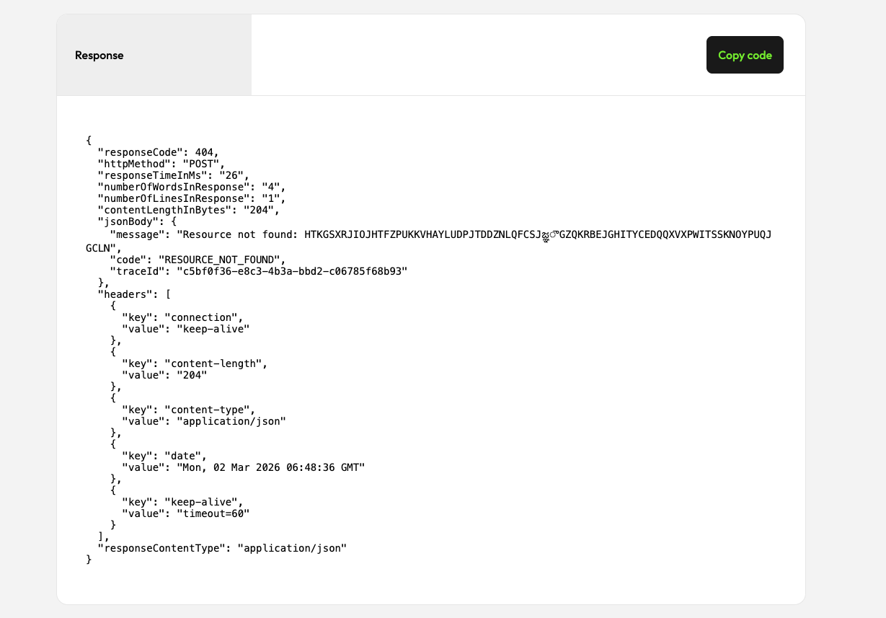
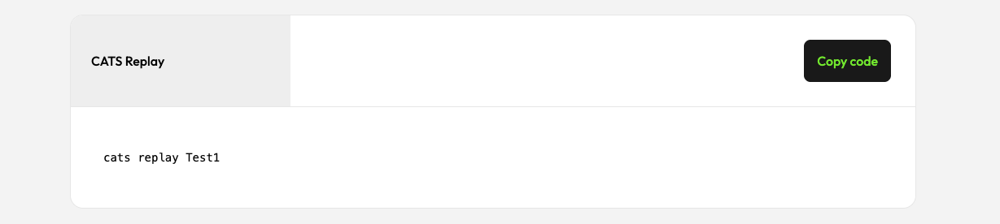
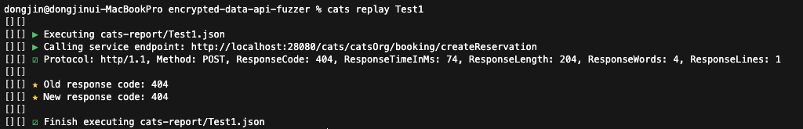

# encrypted-data-api-fuzzer
this repository is encrypted-data-api-fuzzer


## CATS 리포트 보는 법

### 1. Overview


- Total Tests Run: 실행된 테스트 수
- Execution Time: 전체 실행 시간
- HTTP Response Codes: 응답 코드 분포
- Top Failing Paths: 가장 많이 실패한 경로
- Execution Details: 개별 테스트 상세 결과

### 2. 테스트 상세 화면
#### 2.1 Test Case


- 개별 테스트의 `Test Id`, `Trace Id`, `Scenario`, `Expected Result`, `Result`를 확인하는 화면입니다.
- 어떤 퍼저가 어떤 입력을 넣었는지, 기대 결과와 실제 결과가 어떻게 달랐는지 가장 먼저 보는 영역입니다.

#### 2.2 Test Request


- 실제 전송된 요청 정보를 보여줍니다.
- 확인 포인트:
  - `Full Request Path`
  - `Http Method`
  - `Headers`
  - `Payload`
- GW나 mock 서버가 어떤 입력을 받았는지 재현할 때 가장 중요합니다.

#### 2.3 Test Response


- 실제 응답 코드와 응답 바디를 보여줍니다.
- 확인 포인트:
  - `responseCode`
  - `responseBody`
  - `content-type`
  - 응답 시간이 비정상적으로 길지는 않은지
- `Expected Result`와 비교해 왜 `error` 또는 `warning`이 됐는지 판단할 수 있습니다.

#### 2.4 Test Replay



- CATS가 만든 실패 케이스를 다시 호출하는 방법을 보여줍니다.
- 보통 `curl` 재현이나 동일 payload 재실행에 활용합니다.
- 디버깅 순서 추천:
  - CATS 리포트에서 실패 케이스 선택
  - Request/Response 확인
  - Replay 정보로 수동 재현
  - GW 로그와 mock 서버 로그를 함께 확인

## CATS 실행 가이드 (smoke/full)

### 사전 준비
- `cats` CLI 설치
  - 예: `brew tap endava/tap && brew install cats`
- 서버 기동
  - Mock REST API Server: `mock-rest-api-server` (`18080`)
  - Gateway: `gateway` (`28080`)

```bash
cd mock-rest-api-server
./gradlew bootRun
```

```bash
cd gateway
./gradlew bootRun
```

### Smoke 모드 (짧은 실행)
- 축약 계약 파일: `docs/openapi/cats-gw-smoke-openapi.yaml`
- 기본값은 일반 모드입니다. `2xx/4xx/5xx`가 모두 리포트에 반영됩니다.

```bash
/Users/dongjin/dev/study/encrypted-data-api-fuzzer/scripts/run-cats-gw-smoke.sh
```

- blackbox 모드가 필요하면 명시적으로 켭니다.

```bash
BLACKBOX=true SKIP_IGNORED_REPORTING=true \
/scripts/run-cats-gw-smoke.sh
```

### Blackbox 모드란?
- `BLACKBOX=true`는 CATS의 `-b (--blackbox)` 옵션을 켭니다.
- 이 모드에서는 응답을 아래처럼 해석합니다.
  - `5xx`: 에러로 간주
  - `2xx`, `4xx`: ignore 대상으로 간주
- 즉, blackbox 모드는 "서버가 터지는지(5xx)만 빠르게 본다"는 목적에 맞는 실행 모드입니다.

### `BLACKBOX=true SKIP_IGNORED_REPORTING=true`를 넣으면 뭐가 달라지나?
- `BLACKBOX=true`
  - `2xx`, `4xx`는 성공/실패 집계에서 사실상 제외됩니다.
  - `5xx`만 에러로 강조됩니다.
- `SKIP_IGNORED_REPORTING=true`
  - ignore 처리된 결과(`2xx`, `4xx`)를 리포트에서 아예 생략합니다.

- 기본 실행과의 차이:
  - 기본 실행
    - `2xx`, `4xx`, `5xx`가 모두 리포트와 집계에 반영됩니다.
    - 어떤 요청이 통과했고, 어떤 요청이 기대한 4xx로 거절됐는지 볼 수 있습니다.
  - `BLACKBOX=true SKIP_IGNORED_REPORTING=true`
    - `5xx`만 눈에 보이게 남습니다.
    - `2xx`, `4xx`는 결과에서 사라질 수 있습니다.
    - 따라서 `Passed 0`, `Errors 0`, `Total requests 0`처럼 보여도, 실제로는 요청이 수행되었을 수 있습니다.

- 실제 예시 출력:

```text
/cats/{org}/{service}/createReservation ..................................................................................... E 0, W 0, S 0
/cats/{org}/{service}/getResourceInventory .................................................................................. E 0, W 0, S 0
/cats/{org}/{service}/listResources ......................................................................................... E 0, W 0, S 0

[][] ☑ CATS finished in 9.44s. Total requests 0. Passed 0, warnings: 0, errors: 0
```

- 위 출력은 "진짜 아무 요청도 없었다"는 뜻으로 해석하면 안 됩니다.
- blackbox + ignore 생략 모드에서는 `2xx`, `4xx`가 집계에서 빠지기 때문에 저렇게 보일 수 있습니다.

### 언제 어떤 모드를 써야 하나?
- 기본 실행 사용 권장 상황
  - 스펙 정합성 확인
  - `4xx`/`5xx` 비율 확인
  - 어떤 퍼저가 실제로 어떤 결과를 냈는지 자세히 봐야 할 때
- blackbox 모드 사용 권장 상황
  - 운영 관점에서 `5xx`만 빠르게 보고 싶을 때
  - 노이즈를 줄이고 "서버가 죽는가"만 확인하고 싶을 때
  - CI에서 5xx 발생 여부만 빠르게 게이트로 삼고 싶을 때

### Full 모드 (전체 실행)
- 전체 계약 파일: `docs/openapi/cats-gw-openapi.yaml`
- 기본값은 일반 모드입니다. 필요 시 smoke와 동일하게 `BLACKBOX`, `SKIP_IGNORED_REPORTING`을 사용할 수 있습니다.

```bash
./scripts/run-cats-gw-full.sh
```

```bash
BLACKBOX=true SKIP_IGNORED_REPORTING=true \
./scripts/run-cats-gw-full.sh
```

### 기존 스크립트 호환
- `scripts/run-cats-gw.sh`는 full 모드 래퍼입니다.

```bash
./scripts/run-cats-gw.sh
```

### 환경변수 오버라이드
- 공통 환경변수: `CONTRACT_PATH`, `SERVER_URL`, `ORG`, `SERVICE`, `CATS_BIN`, `DRY_RUN`, `BLACKBOX`, `SKIP_IGNORED_REPORTING`

```bash
ORG=testOrg SERVICE=testService \
/Users/dongjin/dev/study/encrypted-data-api-fuzzer/scripts/run-cats-gw-smoke.sh
```

```bash
DRY_RUN=true CATS_BIN=echo \
/Users/dongjin/dev/study/encrypted-data-api-fuzzer/scripts/run-cats-gw-full.sh
```

### GW 응답 코드 기준
- `400 Bad Request`
  - 잘못된 JSON
  - 템플릿 변수 누락
  - 기타 잘못된 요청 본문
- `405 Method Not Allowed`
  - `POST /cats/{org}/{service}/{api}` 이외 메서드 호출
- `503 Service Unavailable`
  - GW가 mock/upstream 서버에 연결하지 못한 경우
- `500 Internal Server Error`
  - 위에서 분류되지 않은 GW 내부 오류

### CATS 결과 해석 팁
- `4xx`가 나왔다고 모두 실패는 아닙니다. 많은 퍼저는 비정상 입력에 대해 `4xx`를 기대합니다.
- 현재 구조에서 우선적으로 줄여야 하는 것은 `500` 입니다.
- `503`가 반복되면 mock REST API Server 또는 upstream 기동 상태를 먼저 확인해야 합니다.
- `BLACKBOX=true`와 `SKIP_IGNORED_REPORTING=true`를 함께 쓰면 `2xx/4xx`가 리포트에서 사실상 사라질 수 있습니다.
- 이 경우 `Passed 0`, `Errors 0`, `Total requests 0`처럼 보여도 실제 요청이 전혀 없었다는 뜻은 아닐 수 있습니다.
- smoke 결과를 분석할 때는 기본 실행을 먼저 보고, 마지막에 blackbox 모드로 `5xx`만 재확인하는 순서를 권장합니다.
