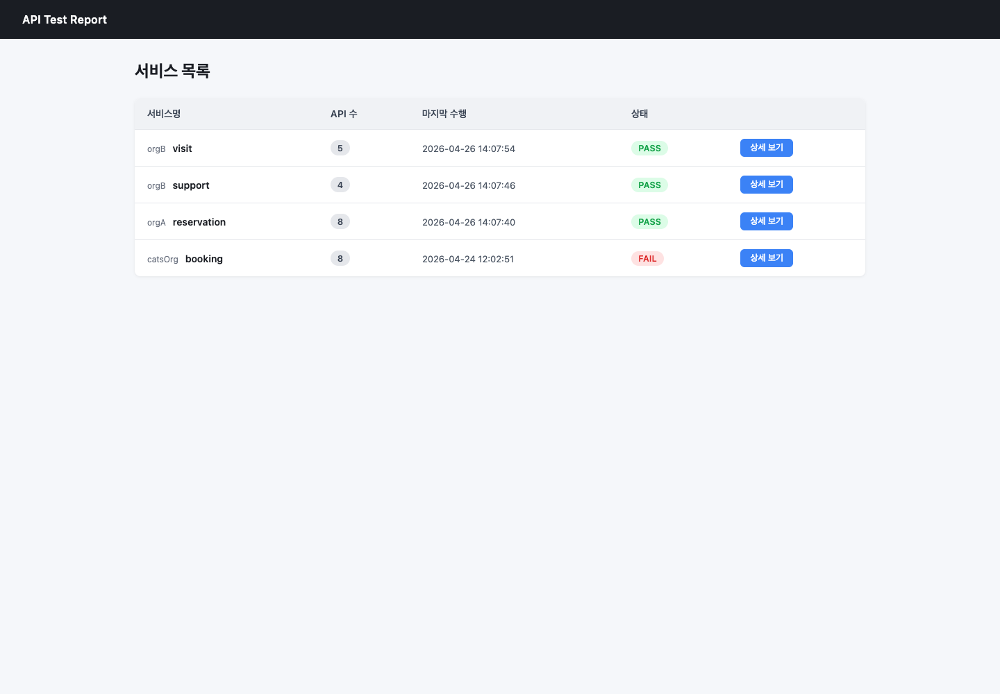
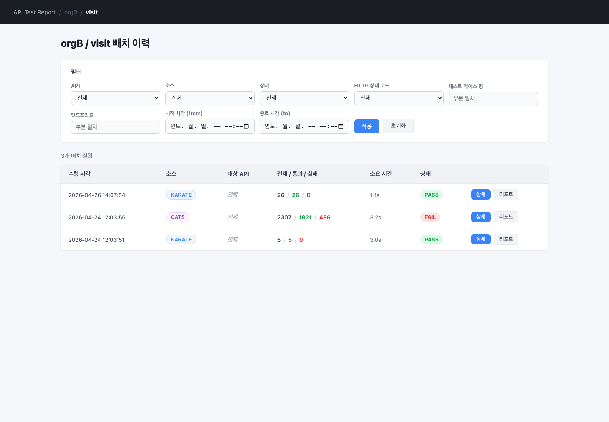
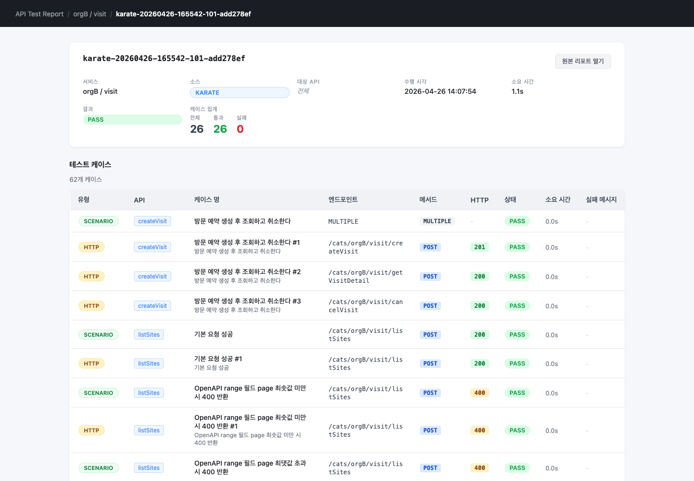
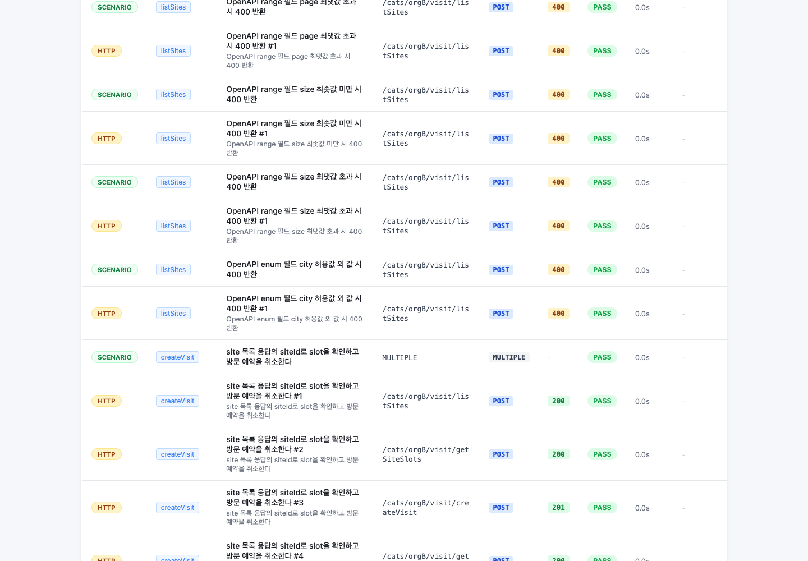

# api-test-orchestrator

OpenAPI/Swagger 계약을 기준으로 Gateway, mock REST API, Karate E2E, CATS fuzzing, 통합 리포트 발행까지 한 번에 검증하는 API 테스트 오케스트레이션 샘플입니다.

## 문서

| 주제 | 문서 |
|---|---|
| 프로젝트 구조와 아키텍처 | [docs/architecture.md](docs/architecture.md) |
| 개발 환경과 mise 태스크 | [docs/development.md](docs/development.md) |
| 테스트 실행 | [docs/testing.md](docs/testing.md) |
| OpenAPI 기반 Karate 생성 규칙 | [docs/karate-generation.md](docs/karate-generation.md) |
| CATS 리포트와 smoke/full 실행 가이드 | [docs/cats-report-guide.md](docs/cats-report-guide.md) |
| OpenAPI 계약 문서 | [docs/openapi/README.md](docs/openapi/README.md) |
| 보안과 설정 | [docs/security.md](docs/security.md) |

## 빠른 시작

mock, gateway, report-server를 각각 실행한 뒤 루트에서 통합 테스트를 실행합니다.

```bash
mise run mock:run
mise run gateway:run
mise run report:run
```

```bash
# 전체 기관/전체 서비스에 대해 Karate + CATS 실행 후 레포트 발행
mise run test

# Karate만 실행
SOURCE=karate mise run test

# CATS만 실행
SOURCE=cats mise run test

# 특정 서비스만 실행
ORG=orgB SERVICE=visit mise run test

# 특정 API만 실행
ORG=catsOrg SERVICE=booking API=createReservation SOURCE=karate mise run test
```

레포트 UI는 아래 주소에서 확인합니다.

```text
http://localhost:48080/
```

## OpenAPI 기반 Karate 테스트

Karate feature는 `docs/openapi/mock-rest-api-server/*.yaml` Swagger 문서를 기준으로 생성합니다. mock 서버 구현 코드를 테스트 입력값의 근거로 사용하지 않고, Swagger의 request schema에 정의된 `required`, `enum`, `format`, `minimum`, `maximum`, `example` 값을 기준으로 정상/negative case를 만듭니다.

생성 규칙과 실행 예시는 [docs/karate-generation.md](docs/karate-generation.md)를 기준으로 관리합니다.

## 리포트 UI 예시

아래 이미지는 Playwright로 캡처한 실제 `report-server` 화면입니다. 최신 Swagger 기반 Karate 실행 결과가 서비스별 PASS 상태와 케이스 수로 표시됩니다.

### 서비스 목록



### 서비스별 배치 이력



### Karate 실행 상세



### OpenAPI negative case 상세



## 리포트 산출물 경로

| 경로 | 역할 |
|---|---|
| `output/` | 수동 검증용 실행 로그와 임시 산출물 보관 |
| `karate-tests/build/karate-reports/karate-reports/` | Karate raw 리포트 |
| `cats-report/` | CATS raw 리포트 |
| `report-server/data/runs/` | `report-server`가 읽는 최종 발행 저장소 |

Karate와 CATS raw 리포트는 publish 스크립트를 거쳐 `report-server/data/runs/{runId}/` 아래로 복사됩니다.
